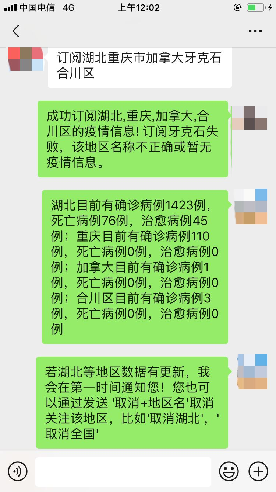
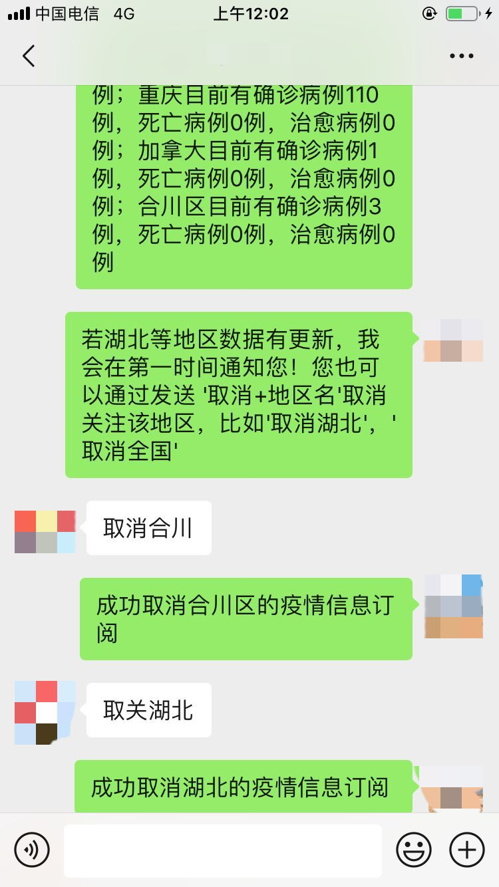
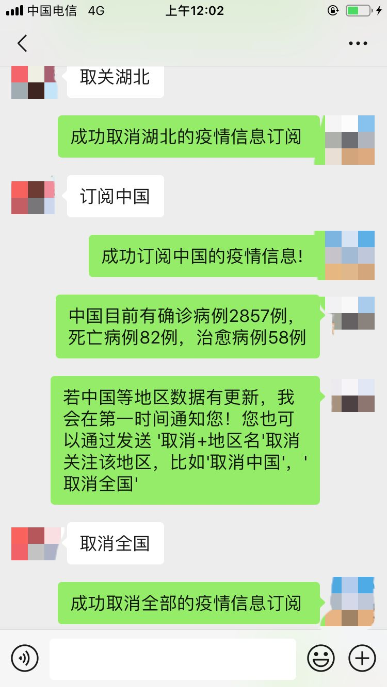

# 疫情信息自动推送微信机器人

### 简介

使用个人微信账户，利用爬虫信息从网络上搜集疫情信息，用户通过微信消息进行订阅，若出现相关信息，则主动对用户推送信息。

## 功能列表

### 1.爬虫模块

- 1.定时从腾讯新闻获取全国疫情数据（地址:[https://news.qq.com/zt2020/page/feiyan.htm](https://news.qq.com/zt2020/page/feiyan.htm)）
- 2.按城市/省份对数据进行存储并对比数据是否更新
- 3.推送更新的数据到微信机器人
- 4.获取全国寻人启事
- 5.获取辟谣信息
- 6.根据用户设定的关键字/城市推送信息

### 2.微信机器人模块

- 0.微信的正常功能（接收和回复消息、添加好友）
- 1.接收用户订阅，包括省份/城市/关键词
- 2.接收更新的数据并转发给订阅的用户
- 3.取消订阅
- 4.消息数量限制

### 3.家族群辟谣机器人

#### 简介

针对指定的微信群（主要是针对家族群这种年龄跨度较大的群），检测聊天记录中的新闻转发（URL或新闻标题），将该信息拿到腾讯辟谣平台上进行搜索，若为谣言，则返回辟谣链接

#### 功能列表

##### 微信机器人模块

- 1.订阅指定微信群
- 2.检测聊天记录，识别URL或新闻标题（正则或文本相似度匹陪）

##### 爬虫模块

两种思路，一是从网上搜集数据，自己写相似度匹配等算法，二是直接调用平台的搜索接口

平台：腾讯辟谣平台，URL：[https://news.qq.com/zt2020/page/feiyan.htm#rumor](https://news.qq.com/zt2020/page/feiyan.htm#rumor)

##### 机器学习模块

- 图片识别，区分表情包、新闻截图等，若是新闻截图可以做ocr提取内容

## 运行环境

- 数据库：Redis
- 部署：Docker

## 部分运行截图

